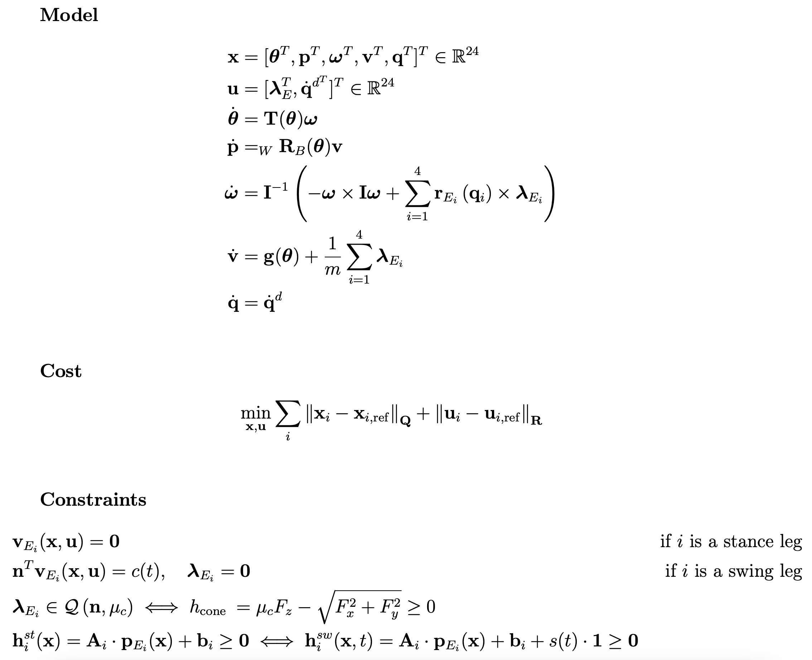
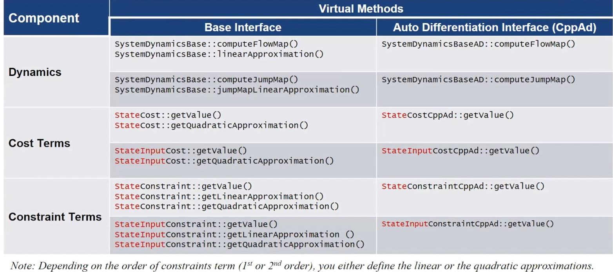
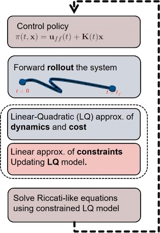
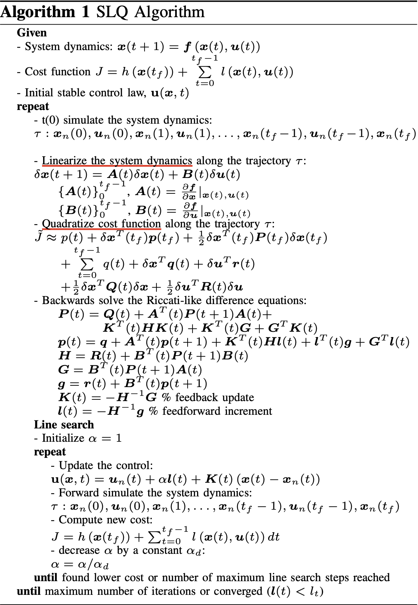
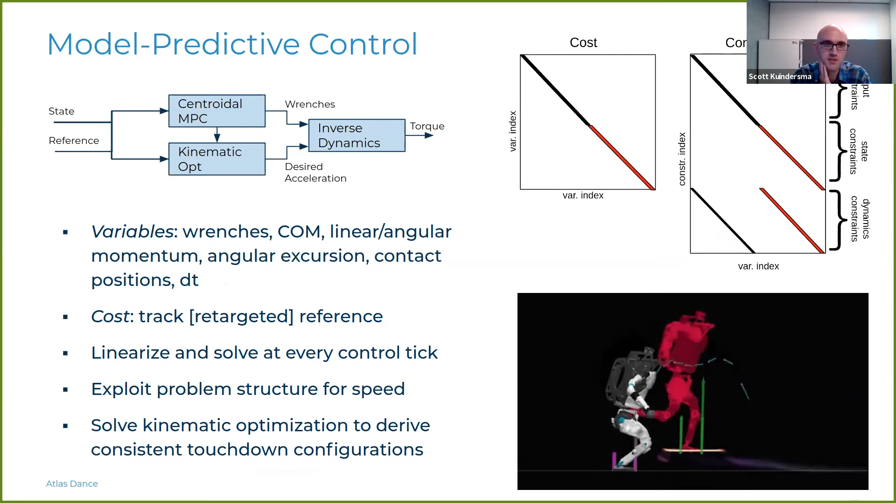

- [ocs2_legged_robot_annotated](#ocs2_legged_robot_annotated)
  - [MIT 控制框架](#mit-控制框架)
  - [ETH 控制框架](#eth-控制框架)
    - [ROS 节点图](#ros-节点图)
    - [Class List](#class-list)
  - [Formulation](#formulation)
    - [Implementation](#implementation)
      - [API](#api)
      - [Example](#example)
        - [代价 `LeggedRobotStateInputQuadraticCost`](#代价-leggedrobotstateinputquadraticcost)
        - [等式约束 `ZeroForceConstraint`](#等式约束-zeroforceconstraint)
        - [动力学模型 `LeggedRobotDynamicsAD`](#动力学模型-leggedrobotdynamicsad)
        - [`LeggedRobotPreComputation`](#leggedrobotprecomputation)
        - [`ReferenceManager` <- `SwitchedModelReferenceManager`](#referencemanager---switchedmodelreferencemanager)
        - [`SolverSynchronizedModule` <- `GaitReceiver`](#solversynchronizedmodule---gaitreceiver)
  - [Solver](#solver)
    - [算法](#算法)
    - [约束处理方法](#约束处理方法)
  - [References](#references)

---

# ocs2_legged_robot_annotated

| 子文件夹            | 功能                      |
| :------------------ | :------------------------ |
| command             | 键盘控制                  |
| common              | 常用功能                  |
| constraint          | 约束类型                  |
| cost                | 代价类型                  |
| dynamics            | 动力学模型 (by Pinocchio) |
| foot_planner        | 摆动腿规划                |
| gait                | 步态设置                  |
| initialization      | 初始化                    |
| synchronized_module | 优化器参数同步            |
| visualization       | 可视化                    |

## MIT 控制框架


## ETH 控制框架


### ROS 节点图


### Class List

- `LeggedRobotModeSequenceKeyboard`: 检测用户指令更新步态改变 Switched Systems 的模式序列 (ModeSequence)
- `EndEffectorLinearConstraint`: 一阶足端位置/速度的线性约束
- `FrictionConeConstraint`: 二阶触地足端摩擦锥不等式约束
- `NormalVelocityConstraintCppAd`: 一阶摆动腿足端Z向速度(=摆动轨腿迹规划的Z向速度 LeggedRobotPreComputation::request)等式约束 (CppAd版)
- `ZeroForceConstraint`: 一阶摆动腿足端零地面反作用力等式约束
- `ZeroVelocityConstraintCppAd`: 一阶触地足端零速度等式约束 (CppAd版)
- `LeggedRobotStateInputQuadraticCost`: 状态与输入的二次代价
- `LeggedRobotDynamicsAD`: 动力学约束 (CppAd版)
- `CubicSpline`: 三次样条曲线
- `SplineCpg`: 摆动腿曲线 (CPG = Central Pattern Generator?)
- `SwingTrajectoryPlanner`: 摆动腿Z向高度规划
- `GaitReceiver`: 步态更新接收器 (A Solver synchronized module is updated once before and once after a problem is solved)
- `GaitSchedule`: 步态定义类
- `LeggedRobotInitializer`: 初始化类
- `SwitchedModelReferenceManager`: Manages the **ModeSchedule** and the **TargetTrajectories** for switched systems
- `LeggedRobotVisualizer`: 可视化类
- `LeggedRobotInterface`: MPC 实现接口
- `LeggedRobotPreComputation`: Request callback are called before getting the value or approximation

## Formulation

X = {Normalized Centroidal Momentum, Base Pose, Leg Joint Positions} 

- vcom_x
- vcom_y
- vcom_z
- L_x / robotMass
- L_y / robotMass
- L_z / robotMass
- p_base_x
- p_base_y
- p_base_z
- theta_base_z
- theta_base_y
- theta_base_x
- LF_HAA_p
- LF_HFE_p
- LF_KFE_p
- LH_HAA_p
- LH_HFE_p
- LH_KFE_p
- RF_HAA_p
- RF_HFE_p
- RF_KFE_p
- RH_HAA_p
- RH_HFE_p
- RH_KFE_p

U = {Feet Contact Forces, Leg Joint Velocities} 

- left_front_force
- left_front_force
- left_front_force
- right_front_force
- right_front_force
- right_front_force
- left_hind_force
- left_hind_force
- left_hind_force
- right_hind_force
- right_hind_force
- right_hind_force
- LF_HAA_v
- LF_HFE_v
- LF_KFE_v
- LH_HAA_v
- LH_HFE_v
- LH_KFE_v
- RF_HAA_v
- RF_HFE_v
- RF_KFE_v
- RH_HAA_v
- RH_HFE_v
- RH_KFE_v



### Implementation
#### API


1. 定义 `OptimalControlProblem`
   - 代价
   - 软约束/硬约束
   - 动力学模型
   - PreComputation
2. 定义 `ReferenceManagerInterface`
3. 定义 `SolverSynchronizedModule`

#### Example

##### 代价 `LeggedRobotStateInputQuadraticCost`
```c++
// Header
class LeggedRobotStateInputQuadraticCost final : public QuadraticStateInputCost {
 public:
  LeggedRobotStateInputQuadraticCost(matrix_t Q, matrix_t R, CentroidalModelInfo info,
                                     const SwitchedModelReferenceManager& referenceManager);

  ~LeggedRobotStateInputQuadraticCost() override = default;
  LeggedRobotStateInputQuadraticCost* clone() const override;

 private:
  LeggedRobotStateInputQuadraticCost(const LeggedRobotStateInputQuadraticCost& rhs) = default;

  std::pair<vector_t, vector_t> getStateInputDeviation(scalar_t time, const vector_t& state, const vector_t& input,
                                                       const TargetTrajectories& targetTrajectories) const override;

  const CentroidalModelInfo info_;
  const SwitchedModelReferenceManager* referenceManagerPtr_;
};

// Implementation
LeggedRobotStateInputQuadraticCost::LeggedRobotStateInputQuadraticCost(matrix_t Q, matrix_t R, CentroidalModelInfo info,
                                                                       const SwitchedModelReferenceManager& referenceManager)
    : QuadraticStateInputCost(std::move(Q), std::move(R)), info_(std::move(info)), referenceManagerPtr_(&referenceManager) {}

LeggedRobotStateInputQuadraticCost* LeggedRobotStateInputQuadraticCost::clone() const {
  return new LeggedRobotStateInputQuadraticCost(*this);
}

std::pair<vector_t, vector_t> LeggedRobotStateInputQuadraticCost::getStateInputDeviation(
    scalar_t time, const vector_t& state, const vector_t& input, const TargetTrajectories& targetTrajectories) const {
  const auto contactFlags = referenceManagerPtr_->getContactFlags(time);
  const vector_t xNominal = targetTrajectories.getDesiredState(time);
  const vector_t uNominal = weightCompensatingInput(info_, contactFlags);
  return {state - xNominal, input - uNominal};
}
```

##### 等式约束 `ZeroForceConstraint`

```c++
// Header
class ZeroForceConstraint final : public StateInputConstraint {
 public:
  /*
   * Constructor
   * @param [in] referenceManager : Switched model ReferenceManager.
   * @param [in] contactPointIndex : The 3 DoF contact index.
   * @param [in] info : The centroidal model information.
   */
  ZeroForceConstraint(const SwitchedModelReferenceManager& referenceManager, size_t contactPointIndex, CentroidalModelInfo info);

  ~ZeroForceConstraint() override = default;
  ZeroForceConstraint* clone() const override { return new ZeroForceConstraint(*this); }

  bool isActive(scalar_t time) const override;
  size_t getNumConstraints(scalar_t time) const override { return 3; }
  vector_t getValue(scalar_t time, const vector_t& state, const vector_t& input, const PreComputation& preComp) const override;
  VectorFunctionLinearApproximation getLinearApproximation(scalar_t time, const vector_t& state, const vector_t& input,
                                                           const PreComputation& preComp) const override;

 private:
  ZeroForceConstraint(const ZeroForceConstraint& other) = default;

  const SwitchedModelReferenceManager* referenceManagerPtr_;
  const size_t contactPointIndex_;
  const CentroidalModelInfo info_;
};

// Implementation
ZeroForceConstraint::ZeroForceConstraint(const SwitchedModelReferenceManager& referenceManager, size_t contactPointIndex,
                                         CentroidalModelInfo info)
    : StateInputConstraint(ConstraintOrder::Linear),
      referenceManagerPtr_(&referenceManager),
      contactPointIndex_(contactPointIndex),
      info_(std::move(info)) {}

bool ZeroForceConstraint::isActive(scalar_t time) const {
  return !referenceManagerPtr_->getContactFlags(time)[contactPointIndex_];
}

vector_t ZeroForceConstraint::getValue(scalar_t time, const vector_t& state, const vector_t& input, const PreComputation& preComp) const {
  return centroidal_model::getContactForces(input, contactPointIndex_, info_);
}

VectorFunctionLinearApproximation ZeroForceConstraint::getLinearApproximation(scalar_t time, const vector_t& state, const vector_t& input,
                                                                              const PreComputation& preComp) const {
  VectorFunctionLinearApproximation approx;
  approx.f = getValue(time, state, input, preComp);
  approx.dfdx = matrix_t::Zero(3, state.size());
  approx.dfdu = matrix_t::Zero(3, input.size());
  approx.dfdu.middleCols<3>(3 * contactPointIndex_).diagonal() = vector_t::Ones(3);
  return approx;
}
```

Note: ReferenceManagerInterface/SolverSynchronizedModule 用来同步更新 OptimalControlProblem 的内部参数.

##### 动力学模型 `LeggedRobotDynamicsAD`

```c++
// Header
class LeggedRobotDynamicsAD final : public SystemDynamicsBase {
 public:
  LeggedRobotDynamicsAD(const PinocchioInterface& pinocchioInterface, const CentroidalModelInfo& info, const std::string& modelName,
                        const ModelSettings& modelSettings);

  ~LeggedRobotDynamicsAD() override = default;
  LeggedRobotDynamicsAD* clone() const override { return new LeggedRobotDynamicsAD(*this); }

  vector_t computeFlowMap(scalar_t time, const vector_t& state, const vector_t& input, const PreComputation& preComp) override;
  VectorFunctionLinearApproximation linearApproximation(scalar_t time, const vector_t& state, const vector_t& input,
                                                        const PreComputation& preComp) override;

 private:
  LeggedRobotDynamicsAD(const LeggedRobotDynamicsAD& rhs) = default;

  PinocchioCentroidalDynamicsAD pinocchioCentroidalDynamicsAd_;
};

// Implementation
LeggedRobotDynamicsAD::LeggedRobotDynamicsAD(const PinocchioInterface& pinocchioInterface, const CentroidalModelInfo& info,
                                             const std::string& modelName, const ModelSettings& modelSettings)
    : pinocchioCentroidalDynamicsAd_(pinocchioInterface, info, modelName, modelSettings.modelFolderCppAd,
                                     modelSettings.recompileLibrariesCppAd, modelSettings.verboseCppAd) {}

vector_t LeggedRobotDynamicsAD::computeFlowMap(scalar_t time, const vector_t& state, const vector_t& input, const PreComputation& preComp) {
  return pinocchioCentroidalDynamicsAd_.getValue(time, state, input);
}

VectorFunctionLinearApproximation LeggedRobotDynamicsAD::linearApproximation(scalar_t time, const vector_t& state, const vector_t& input,
                                                                             const PreComputation& preComp) {
  return pinocchioCentroidalDynamicsAd_.getLinearApproximation(time, state, input);
}
```

##### `LeggedRobotPreComputation`

```c++
// Header
class LeggedRobotPreComputation : public PreComputation {
 public:
  LeggedRobotPreComputation(PinocchioInterface pinocchioInterface, CentroidalModelInfo info,
                            const SwingTrajectoryPlanner& swingTrajectoryPlanner, ModelSettings settings);
  ~LeggedRobotPreComputation() override = default;

  LeggedRobotPreComputation* clone() const override;

  void request(RequestSet request, scalar_t t, const vector_t& x, const vector_t& u) override;

  const std::vector<EndEffectorLinearConstraint::Config>& getEeNormalVelocityConstraintConfigs() const { return eeNormalVelConConfigs_; }

  PinocchioInterface& getPinocchioInterface() { return pinocchioInterface_; }
  const PinocchioInterface& getPinocchioInterface() const { return pinocchioInterface_; }

 private:
  LeggedRobotPreComputation(const LeggedRobotPreComputation& other) = default;

  PinocchioInterface pinocchioInterface_;
  CentroidalModelInfo info_;
  const SwingTrajectoryPlanner* swingTrajectoryPlannerPtr_;
  const ModelSettings settings_;

  std::vector<EndEffectorLinearConstraint::Config> eeNormalVelConConfigs_;
};

// Implementation
LeggedRobotPreComputation::LeggedRobotPreComputation(PinocchioInterface pinocchioInterface, CentroidalModelInfo info,
                                                     const SwingTrajectoryPlanner& swingTrajectoryPlanner, ModelSettings settings)
    : pinocchioInterface_(std::move(pinocchioInterface)),
      info_(std::move(info)),
      swingTrajectoryPlannerPtr_(&swingTrajectoryPlanner),
      settings_(std::move(settings)) {
  eeNormalVelConConfigs_.resize(info_.numThreeDofContacts);
}

LeggedRobotPreComputation* LeggedRobotPreComputation::clone() const {
  return new LeggedRobotPreComputation(*this);
}

void LeggedRobotPreComputation::request(RequestSet request, scalar_t t, const vector_t& x, const vector_t& u) {
  if (!request.containsAny(Request::Cost + Request::Constraint + Request::SoftConstraint)) {
    return;
  }

  // lambda to set config for normal velocity constraints
  auto eeNormalVelConConfig = [&](size_t footIndex) {
    EndEffectorLinearConstraint::Config config;
    config.b = (vector_t(1) << -swingTrajectoryPlannerPtr_->getZvelocityConstraint(footIndex, t)).finished();
    config.Av = (matrix_t(1, 3) << 0.0, 0.0, 1.0).finished();
    if (!numerics::almost_eq(settings_.positionErrorGain, 0.0)) {
      config.b(0) -= settings_.positionErrorGain * swingTrajectoryPlannerPtr_->getZpositionConstraint(footIndex, t);
      config.Ax = (matrix_t(1, 3) << 0.0, 0.0, settings_.positionErrorGain).finished();
    }
    return config;
  };

  if (request.contains(Request::Constraint)) {
    for (size_t i = 0; i < info_.numThreeDofContacts; i++) {
      eeNormalVelConConfigs_[i] = eeNormalVelConConfig(i);
    }
  }
}
```

##### `ReferenceManager` <- `SwitchedModelReferenceManager`

##### `SolverSynchronizedModule` <- `GaitReceiver`

## Solver


### 算法


### 约束处理方法

| 约束类型             | 处理方法                                            |
| :------------------- | :-------------------------------------------------- |
| State-input 等式约束 | Lagrangian method/Projection technique              |
| State-only 等式约束  | Penalty method -> **Augmented Lagrangian**          |
| 不等式约束           | Relaxed barrier methods -> **Augmented Lagrangian** |

## References

- [Tutorial on OCS2 Toolbox](https://www.youtube.com/watch?v=RYmQN9GbFYg)
- [Multi-Layered Safety for Legged Robots via Control Barrier Functions and Model Predictive Control](https://arxiv.org/abs/2011.00032)
- [Fast nonlinear Model Predictive Control for unified trajectory optimization and tracking](https://ieeexplore.ieee.org/document/7487274)
- [数值最优化方法](https://book.douban.com/subject/26004211/)
- [Numerical Optimization](https://book.douban.com/subject/2870337/)
- [Software Tools for Real-Time Optimal Control](https://mpcworkshop.org)
  - [TrajectoryOptimization.jl](https://github.com/RoboticExplorationLab/TrajectoryOptimization.jl)
  - [OCS2](https://github.com/leggedrobotics/ocs2)
  - [Crocoddyl](https://github.com/loco-3d/crocoddyl)
  - [SCP Toolbox](https://github.com/dmalyuta/scp_traj_opt)

